try_d是在try_b的基础上训练的
- try_d 修改如下：
    - 
    - 
    - 
    - 
- try_e
    -
- try_f 失败，上来摔倒
    -  其中没有修改act_const
    - 
- try_g 小的突破 算是可以踉踉跄跄的“直线”行走，并且不摔倒
    - 
    - 
    - 
    - 
- try_h 可以保持走直线，但是姿态不好，并且最后会摔倒
    - 
    - 
    - 
    - 
- try_i 失败，上来就摔倒
    - 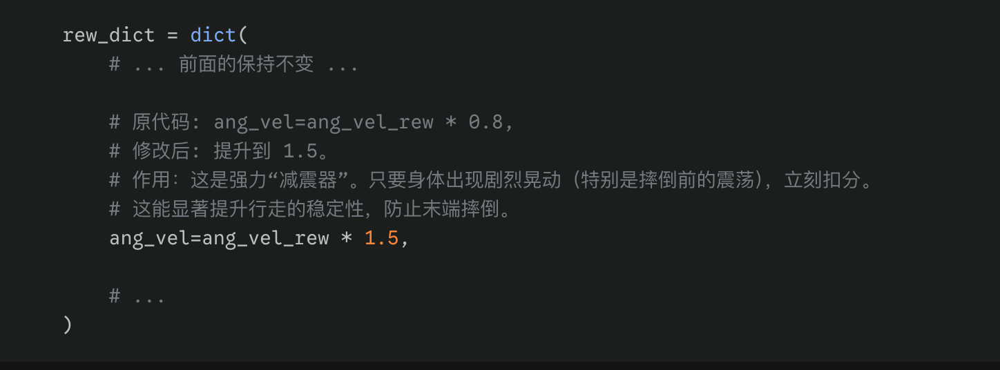
    - 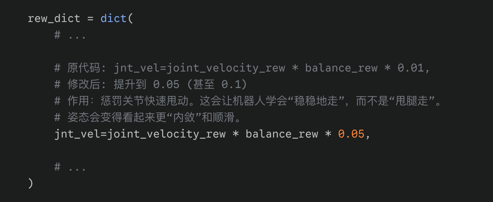
    - 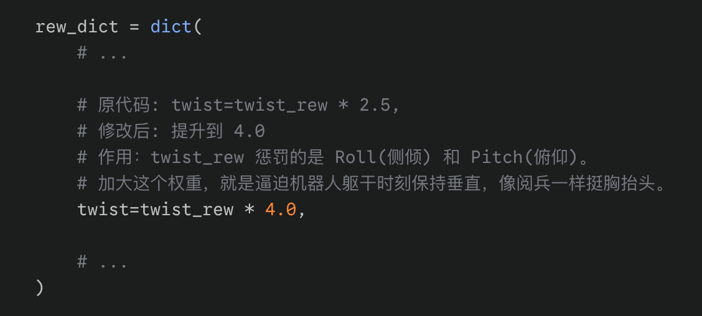我的修改为3.5了
- try_j 失败，上来就摔倒
    - 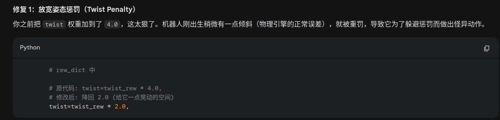
    - 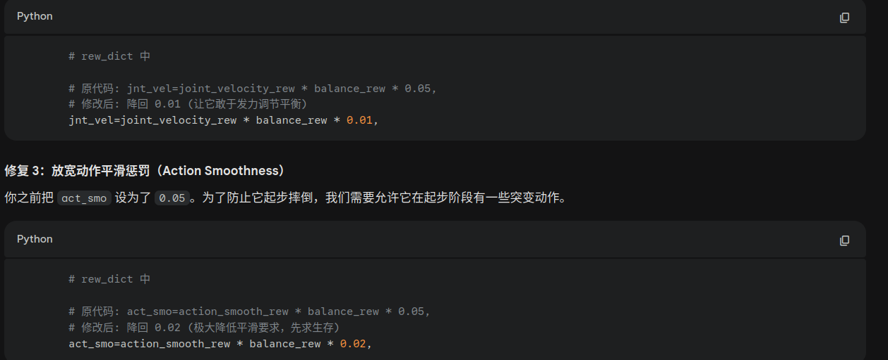其中act_smo改为了0.04
    - 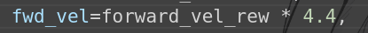
---------------------------------------------------------
- 回退到 try_h
- try_k 摔跤
    - 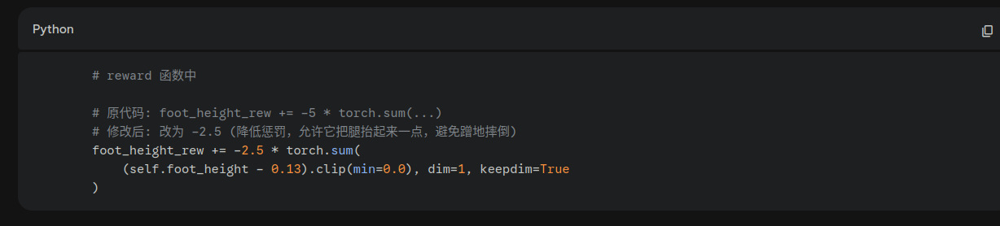
    - 
    - 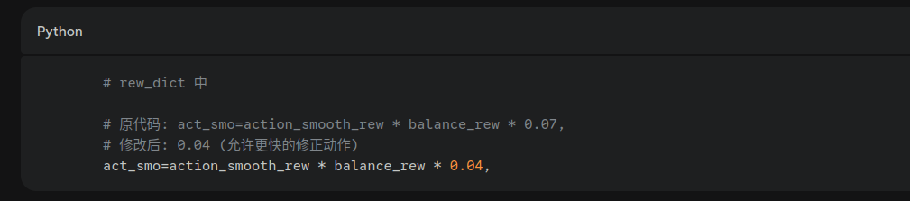
- try_l
    - 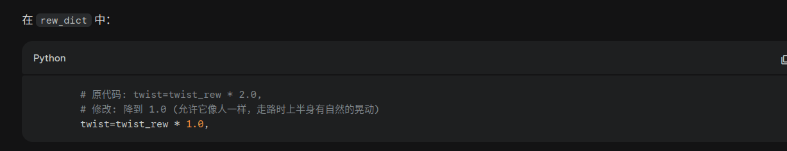我的改为了1.5
    - 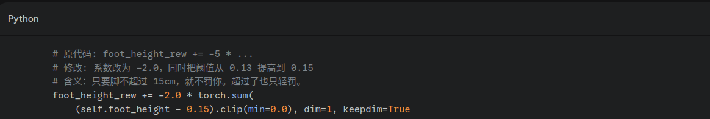
    - 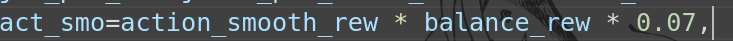
- try_m
    - 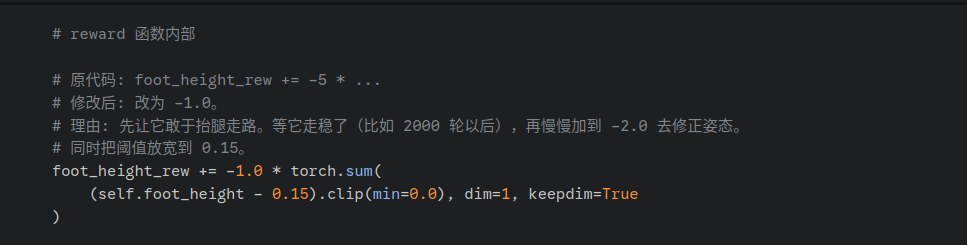
    - 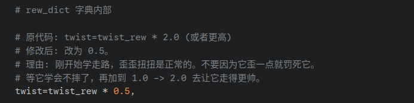
    - 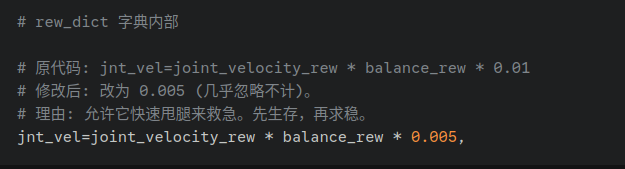
    - 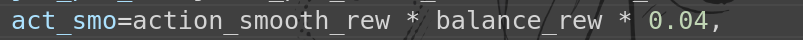
----------------------------------------
回退到try_h 
- try_n 还是一般
    -只是增加了训练epoch的try_h
- try_o 摔倒
    - 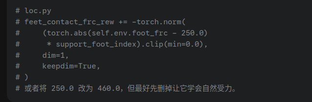 我的是注释掉了
    - 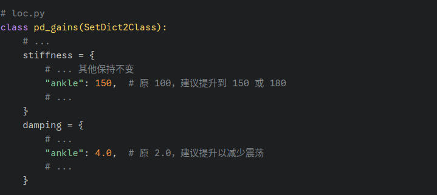
    - 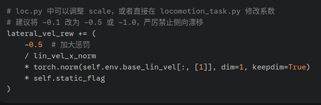
    - 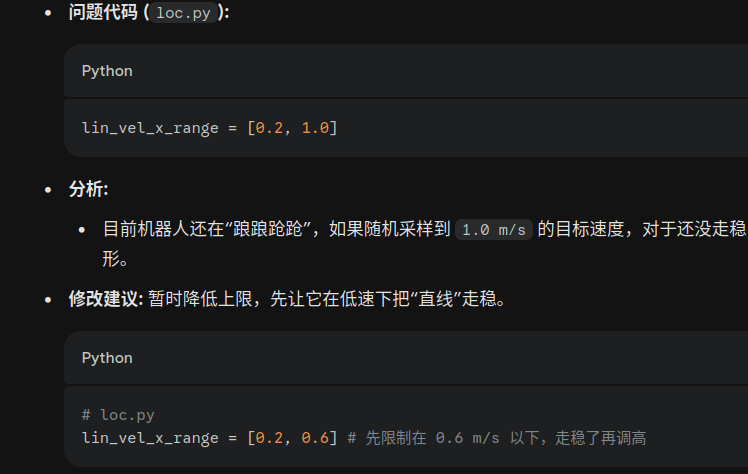我改成了0.2到0.7
- try_p 还不错，就是一开始会跳跃下，然后会倒退然后才能前进
    - 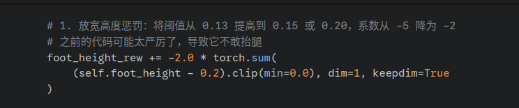
    - 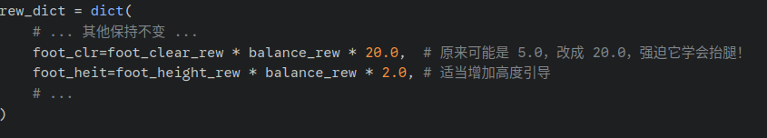 height原先是0.8
    - 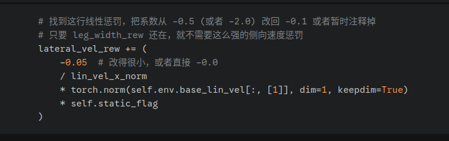 原先是0.5改为的0.1
    - 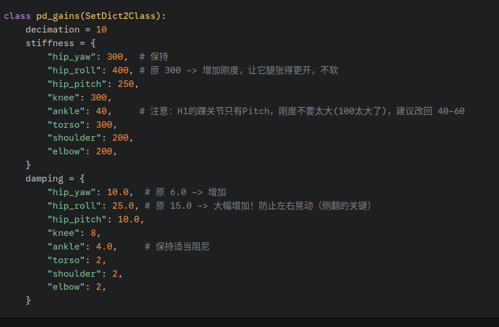
- try_q
    - 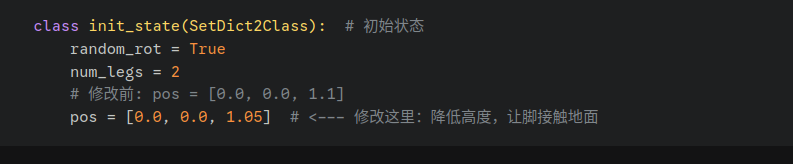
    - 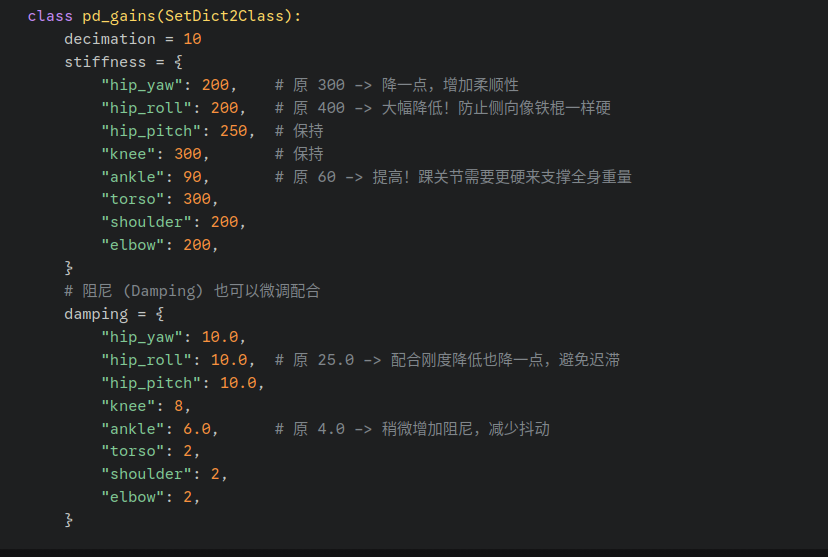其中实际修改值为：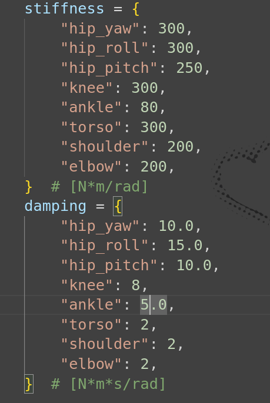
- try_r
    - 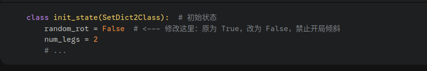
    - 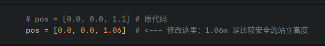
    - 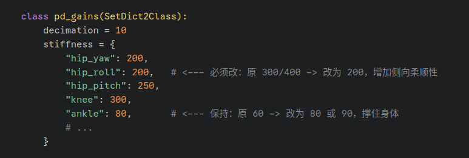
- try_s
    -  原先是4
- try_t
    - forward_red=8.5