try_d是在try_b的基础上训练的
- try_d 修改如下：
    - 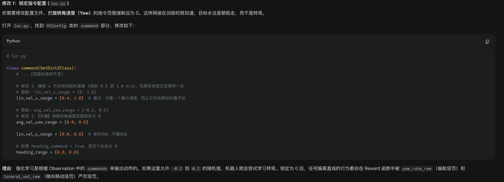
    - 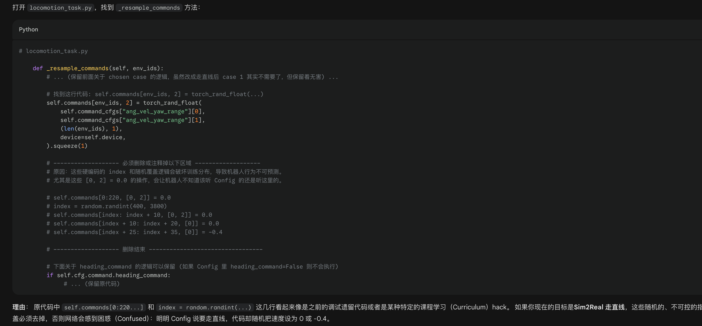
    - 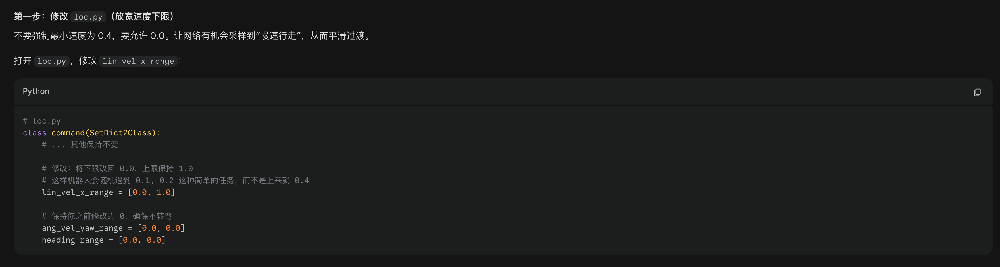
    - 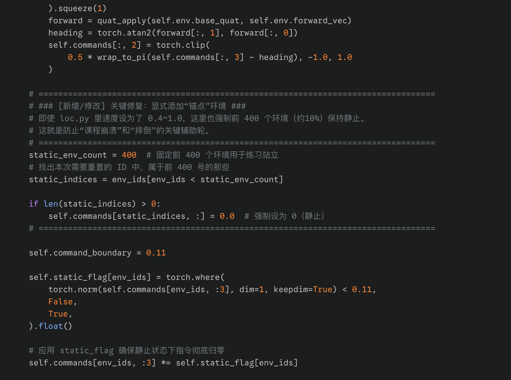
- try_e
    -
- try_f 失败，上来摔倒
    - 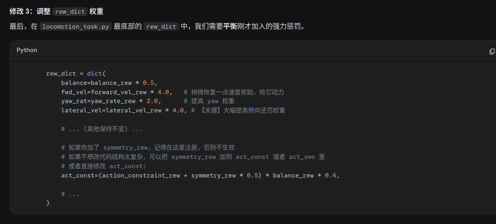 其中没有修改act_const
    - 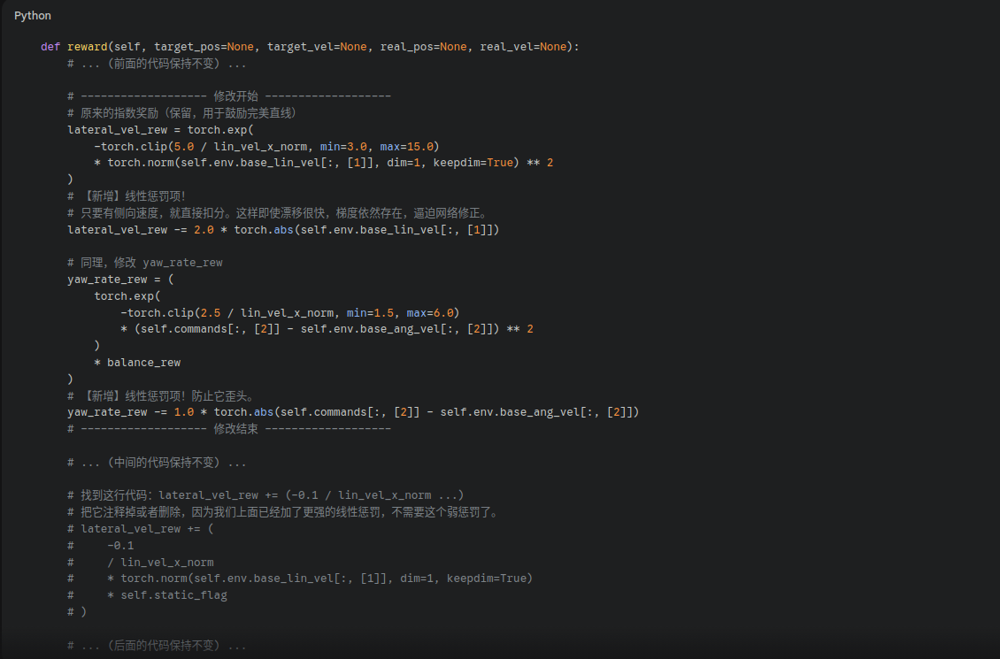
- try_g 小的突破 算是可以踉踉跄跄的“直线”行走，并且不摔倒
    - 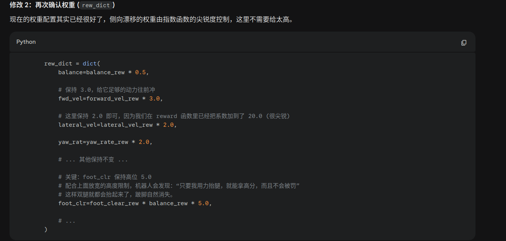
    - 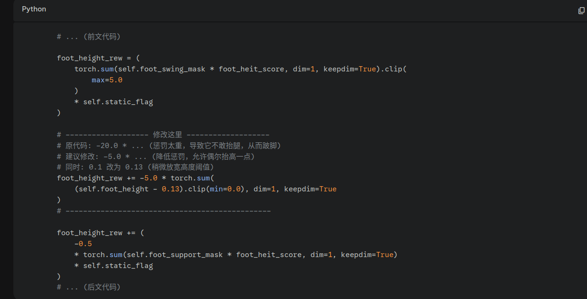
    - 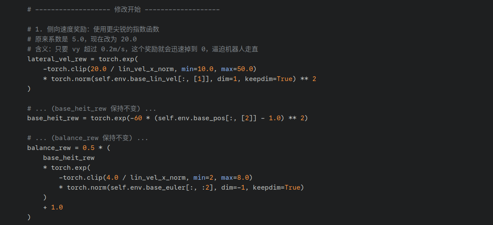
    - 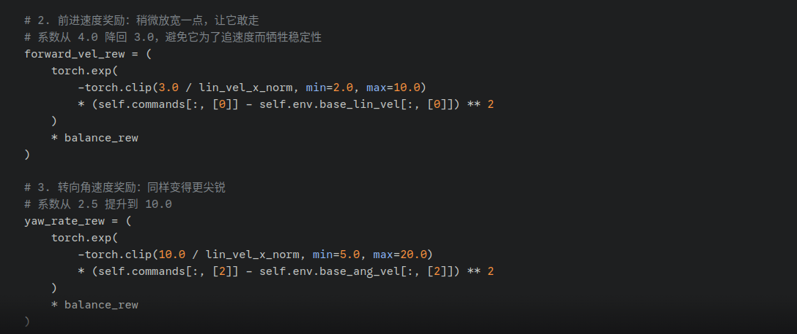
- try_h 可以保持走直线，但是姿态不好，并且最后会摔倒
    - 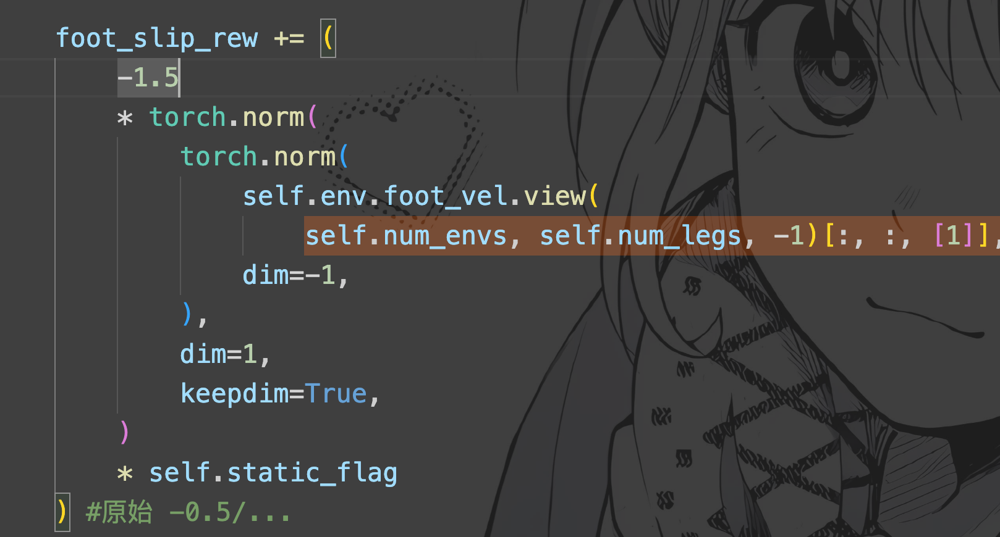
    - 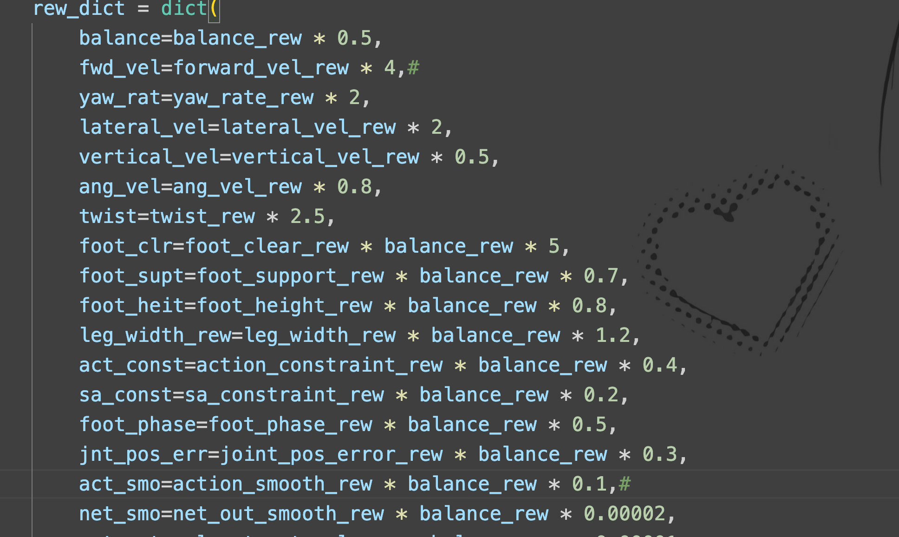
    - 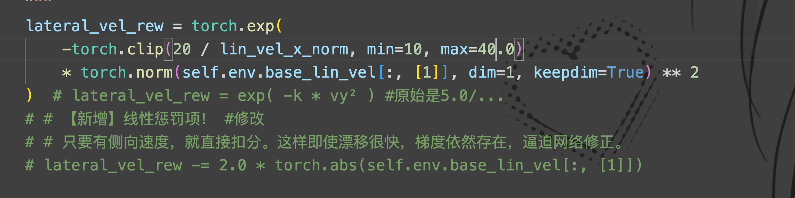
    - 